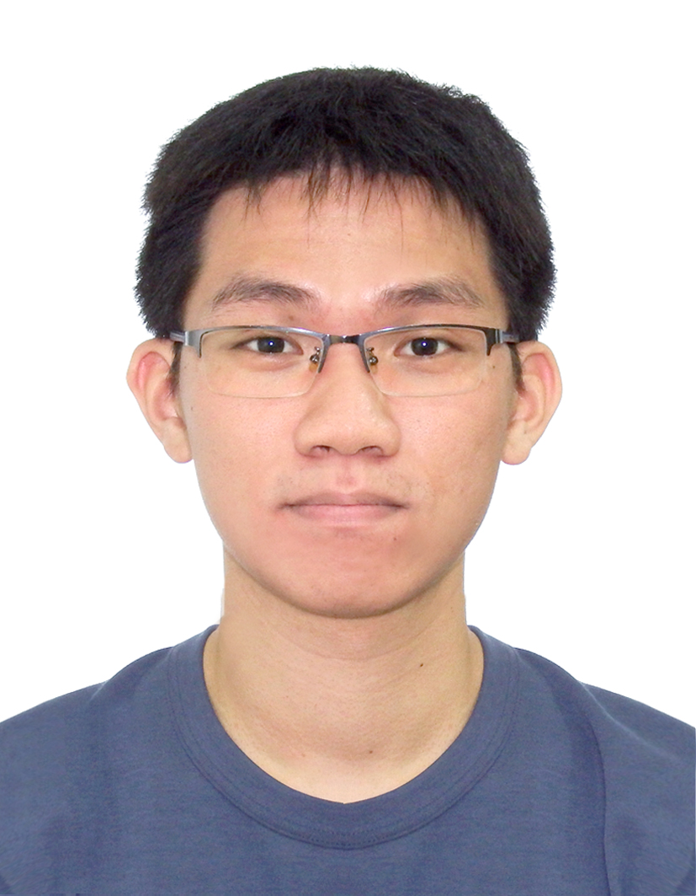
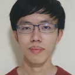
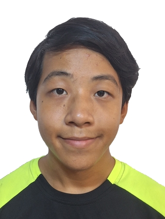
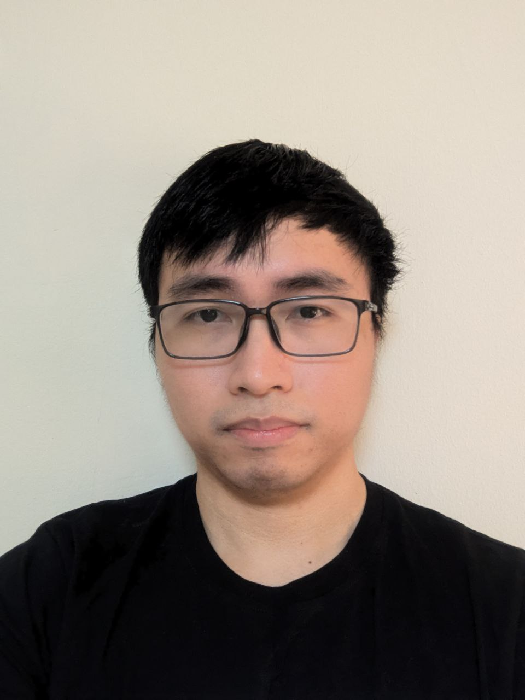

# About Us

We are a team based in the [School of Computing, National University of Singapore](http://www.comp.nus.edu.sg).

You can reach us at the email `seer[at]comp.nus.edu.sg`.

## Project team

### Ng Yu Peng

[[github](http://github.com/ngyupeng)]
[[portfolio](team/ngyupeng.md)]

* Role: Developer
* Responsibilities: UI

### An Jun

[[github](http://github.com/limanjun99)]
[[portfolio](team/limanjun99.md)]

* Role: Developer
* Responsibilities: Testing

### Ding Yitao

[[github](http://github.com/yitao36)] [[portfolio](team/yitao36.md)]

* Role: Testing
* Responsibilities: In charge of Model

### 3seastacks

[[github](http://github.com/3seastacks)]
# [[portfolio](team/3seastacks.md)]

* Role: Developer
* Responsibilities: Documentation

### Hua Jun

[[github](http://github.com/huajun07)]
[[portfolio](team/huajun07.md)]

* Role: Documentation
* Responsibilities: Storage
