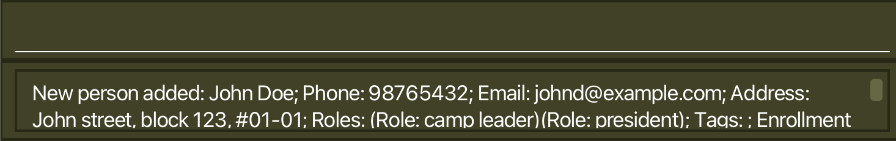
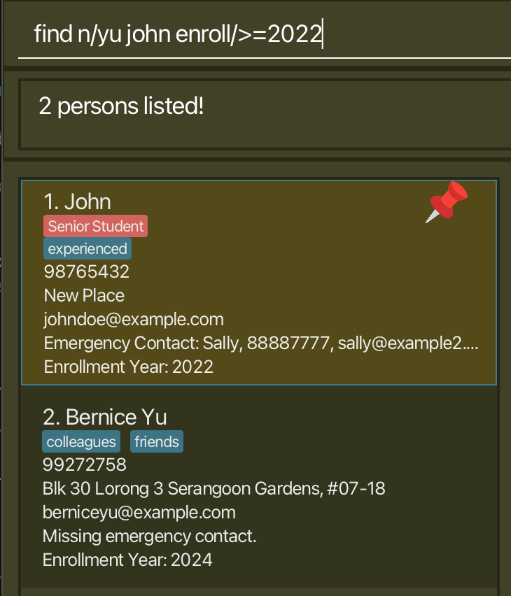
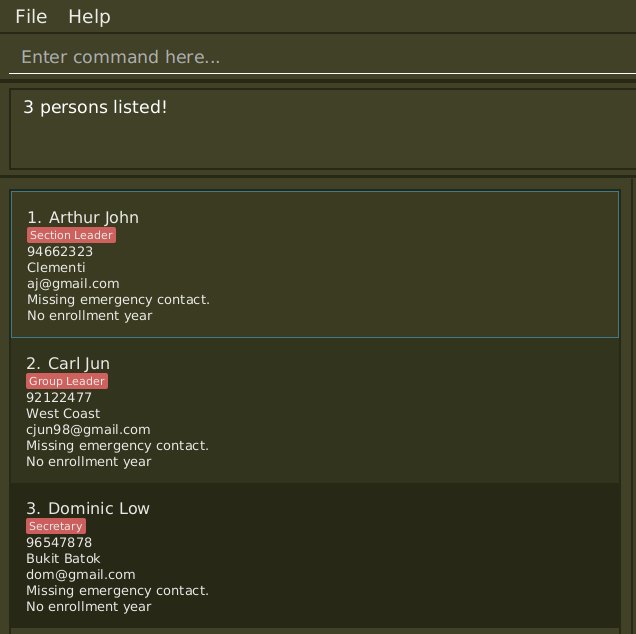

# CCAmper :fa-solid-campground: User Guide

<!-- * Table of Contents -->
<page-nav-print />

--------------------------------------------------------------------------------------------------------------------
## Welcome to CCAmper!
CCAmper is the perfect app for **Singaporean secondary school teachers** as an all-in-one desktop app for
- Managing all your various CCA student details plus emergency contact details
- Keeping track of their attendance with respect to various events

CCAmper is optimized for use via a **Command Line Interface (CLI)** to help secondary school teachers to
**plan, manage, and simplify** your CCA's weekly tasks faster than traditional **Graphical User Interface (GUI)** apps.

<box type="info" seamless>

**Advanced keyboard technique:** Use `tab` to switch between the input box, person list, and event list! 
While focused on the person list or event list, use `up` and `down` to navigate quickly.
</box>

## Quick start

1. Download and install Java `17` or above from this
   <a href="https://www.oracle.com/java/technologies/downloads/#java17">Java downloads page</a>. 
   **Mac users:** Ensure you have the precise JDK version prescribed
   [here](https://se-education.org/guides/tutorials/javaInstallationMac.html).  {{ verifyJava17Box }}

2. Download our latest CCAmper `.jar` file from our [GitHub page](https://github.com/AY2526S1-CS2103T-T10-4/tp/releases).

3. Copy the file to the folder you want to use as the _home folder_ for your AddressBook.
    We recommend placing the `.jar` file into a folder named `CCAmper` on your desktop for easy access.

4. Open a command terminal, navigate into the folder containing the `.jar` file,
   and use the `java -jar addressbook.jar` command to run the application.
 {{ navigateGuideBox }}
5. A GUI similar to the below should appear in a few seconds. Note how the app contains some sample data.
The layout of the application is also shown below. Clicking on a person or event will show more detailed information
about the corresponding item in `DetailedPanel`.
  
    
 

6. Type the command in the command box and press Enter to execute it. e.g. typing **`help`** and pressing Enter will open the help window. 

7. Refer to the [Features](#features) below for details of each command.

--------------------------------------------------------------------------------------------------------------------

## Features

### Prerequisite knowledge

<box type="info" seamless>

**Notes about the syntax and command format:** 

* Prefixes start with letters followed by a slash, e.g. `n/`. 
  Certain prefixes are reserved for each command, meaning that it is not possible to
  supply a string starting with the reserved prefix to another prefix. Workaround is to use other characters.
  * e.g. `a/FRONT n/MIDDLE BACK` is parsed as two separate prefixes.  
    
* Words in `UPPER_CASE` are the parameters to be supplied by the user. 
  e.g. in `add n/NAME`, `NAME` is a parameter which can be used as `add n/John Doe`.

* Items in **square brackets** are optional. 
  * e.g `n/NAME [t/TAG]` can be used as `n/John Doe t/friend` or as `n/John Doe`.
  * e.g `n/NAME [enroll/[YEAR]]` can be used as `n/John enroll/` or as `n/John enroll/2024` or as `n/John`.  

* Items with `…` after them can be used multiple times including zero times. 
  e.g. `[t/TAG]…` can be empty, `t/friend`, `t/family` etc.

* Parameters can be in any order. 
  e.g. if the command specifies `n/NAME p/PHONE_NUMBER`, `p/PHONE_NUMBER n/NAME` is also acceptable.

* For commands that do not take in parameters (such as `help`, `list`, `exit` and `clear`), there should not be any characters (except whitespace) that comes before and/or follow the command keyword. This is to avoid scenarios such as `help list exit`, where command keyed in may be unclear.

* If you are using a PDF version of this document, be careful when copying and pasting commands that span multiple lines as space characters surrounding line-breaks may be omitted when copied over to the application.
</box>

<box type="important" seamless>

**Constraints on Person contacts**

| Field                 | Requirements                                                                                                                                                                                                                                                                                         |
|-----------------------|------------------------------------------------------------------------------------------------------------------------------------------------------------------------------------------------------------------------------------------------------------------------------------------------------|
| Name                  | • Max 50 characters long. • Letters, numbers, and spaces and the following `.,-'()/` only. • Cannot be blank                                                                                                                                                                                   |
| Phone                 | • Encouraged input format: 8-digit Singaporean phone number that starts with one of `3/6/8/9`.   • While it is possible to key in any other inputs such as 90909090 (HP) or +60-12-345 6789, application would issue warnings. This helps to signal a deviation from the encouraged input format (e.g. 90909090 or 9090 9090), allowing users to manually check if the phone number they keyed in is correct.   • While users can key in phone numbers with hyphens and space, these hyphens and space would be removed when phone number is stored in CCAmper.                                                                                                                                                                                                              |
| Email                 | • Max 50 characters long. • Local-part contains only alphanumeric characters and the following `+_.-`. The local parts may not start or end with any special characters.   • Domain labels are separated by period, consist of only alphanumeric characters and hyphens,  and the end part (after the period) must be at least 2 characters long.  (example.email@do-main.ca) |
| Address               | • Max 70 characters long. • Any characters, but cannot be blank.                                                                                                                                                                                                                                 |
| Year                  | • Positive integer, or blank to not add one.                                                                                                                                                                                                                                                         |
| Roles                 | • Maximum 20 characters for each role, maximum of 3 roles. • Contains only alphanumeric characters or spaces.                                                                                                                                                                                    |
| Tags                  | • Maximum 15 characters for each tag, maximum of 5 tags. • Contains only alphanumeric characters (No spaces).                                                                                                                                                                                    |
| Emergency Contact | • Name and Phone of emergency contact has the same constraints as specified above. • Phone of emergency contact must not be the same as student's.                                                                                                                                               |
| Pin                   | • Input either `TRUE` or `FALSE` (Non case-sensitive)                                                                                                                                                                                                                                                |

**Duplicate handling**
* We require that no two person have the exact same `Name` and `Phone` combination.

</box>

<box type="tip" seamless>

**Style Guide**

* Additionally, we check user input if they follow the recommended style for the field. 
  These do not throw an error, but will display a warning message after the command finishes execution, 
  and during launch of the program.

| Field                 | Style Guide                                                                                                                                                                                                                     |
|-----------------------|:--------------------------------------------------------------------------------------------------------------------------------------------------------------------------------------------------------------------------------|
| Name                  | • Proper capitalization (First letter of each word is capitalized)  e.g. `Al-Amaan`, `John's Dad` is proper, but `john`, `Bob(f)` is not. • No consecutive spaces • Brackets close, e.g. `John (Doe` is not stylish |
| Address               | • Proper capitalization                                                                                                                                                                                                         |
| Roles                 | • Proper capitalization • No consecutive spaces                                                                                                                                                                             |
| Emergency Contact | • Name field has the same recommendations as specified above. • Name field should be different from student's name.                                                                                                         |

</box>

### Successful Commands

Succesful commands should look like such:

  

### Invalid Commands
A warning message will be provided for invalid commands with text providing help on command usage:

  

### Viewing help : `help`

A popup appears which redirects the user to this current page. :D

  

### Adding a person: `add`

Add students to your address book, with the given fields.

Format: `add n/NAME p/PHONE_NUMBER e/EMAIL a/ADDRESS [r/ROLE]…​ [t/TAG]… [pin/TRUE] [enroll/YEAR] [ecn/EMERGENCY_NAME] [ecp/EMERGENCY_PHONE]`

Additional information on fields:
* While one may key in phone numbers with hyphen(s) and/or space(s) to improve human-readability, the hyphen(s) and space(s) are automatically removed when phone number is stored in app.
* The emergency contact fields (`ecn` and `ecp`) must be either all provided or not at all.

Examples:
* `add n/John Doe p/98765432 e/johnd@example.com a/John street, block 123, #01-01 r/President r/Camp leader ecn/Jack Doe ecp/99998888 ece/jackd@example.com enroll/2022 t/friend`
* `add n/Betsy Crowe t/friend e/betsycrowe@example.com a/Newgate Prison p/98765432 t/criminal enroll/2024`

Note: 
* If there are multiple errors when keying in the add command (e.g. duplicate fields, missing compulsory fields, some fields do not follow the correct format), CCAmper may show error messages in batches, rather than all at once, and only show the next batch of error messages once the current batch of error messages is resolved. This is to help users avoid information overload.
 
<box type="tip">

**Tip:** Refer to the constraints specified above for each of the fields!
</box>

 

### Listing all persons : `list`

Resets any `find`, `event:student` or `student:event` filters used, and displays all persons and events in the address book.

Format: `list`

This command brings you back to the default view:

  

### Editing a person : `edit`

Edits an existing person in the address book.

Format: `edit INDEX [n/NAME] [p/PHONE] [e/EMAIL] [a/ADDRESS] [r/ROLE]…​ [t/TAG]…​ [pin/(TRUE/FALSE)] [enroll/[YEAR]] [ecn/EMERGENCY_NAME] [ecp/EMERGENCY_PHONE]`

* Edits the person at the specified `INDEX`. The index refers to the index number shown in the displayed person list. The index **must be a positive integer** 1, 2, 3, …​
* At least one of the optional fields must be provided.
* Existing values will be updated to the input values.
* When editing tags, the existing tags of the person will be removed i.e adding of tags is not cumulative.
* You can remove all the person’s tags by typing `t/` without specifying any tags after it.
* Editing roles follows the same rules as editing tags.
* The pin field takes in either "TRUE" or "FALSE"
* If the student has no emergency contact, then both emergency contact fields (`ecn` and `ecp`) must be either both provided or not at all.
* The enrollment year should be a positive integer or empty string (to delete)

Examples:
*  `edit 1 p/91234567 e/johndoe@example.com` Edits the phone number and email address of the 1st person to be `91234567` and `johndoe@example.com` respectively.
*  `edit 2 n/Betsy Crower t/` Edits the name of the 2nd person to be `Betsy Crower` and clears all existing tags.
*  `edit 3 n/Jack Wilson r/` Edits the name of the 3rd person to be `Jack Wilson` and clears all existing roles.
*  `edit 1 n/John p/98765432 e/johndoe@example.com a/New Place r/Senior Student t/experienced pin/TRUE enroll/2022 ecn/Sally ecp/88887777`

### Locating persons by fields: `find`

Display a list of persons satisfying the search constraint.

Format: `find [n/KEYWORD [MORE_KEYWORDS]] [t/KEYWORD [MORE_KEYWORDS]] [enroll/[(<\|<=\|>\|>=\|=)NUMBER]] [r/KEYWORD]…`

* At least one prefix must be provided.
* If different prefixes are provided, a list of persons matching ALL the given constraints are shown 
(except for groups of prefixes that are the same, which will be `OR` search).

| Search type                                     | Notes                                                                                                                                                                                                                                                                                                                                                  |
|-------------------------------------------------|--------------------------------------------------------------------------------------------------------------------------------------------------------------------------------------------------------------------------------------------------------------------------------------------------------------------------------------------------------|
| Name (n/NAME...)                                | • Case-insensitive • Matches the full word, e.g. `Han` does not match `Hans` • If more than 1 keyword is specified, people with names matching at least one keyword is returned (`OR` search). e.g. `Hans Bo` returns `Bo Yang` and `Hans Gruber`                                                                                          |
| Tag (t/TAG...)                                  | • Case-insensitive • Matches substrings of the word. e.g. `friend` will match `friends`. • If more than 1 keyword is specified, people with tags matching any is returned. (`OR` search)                                                                                                                                                       |
| Role (r/\[ROLE]) \[r/ROLE]...                   | • Case-insensitive • Matches substrings of the word. • Spaces are included in the search.  e.g. `r/section leader` matches `Section Leader` but not `Section Head` and not `Leader Section`. • Leave empty to search for people with at least any 1 role. • Multiple roles can be specified using multiple prefixes. (`OR` search) |
| Enrollment Year (enroll/\[OPERATOR + YEAR]) | • Must be either empty (Search for people with empty year field)  or contain one of the following operators `<, <=, >, >=, =` and a positive integer. e.g. `<2025` returns people enrolled in `2024` or earlier.                                                                                                                               |

Examples:
* `find n/John` returns `john` and `John Doe`
* `find n/yu john enroll/>=2022` returns `John`, `Bernice Yu` 

  

* `find r/lead r/sec` returns `Arthur John`, `Carl Jun`, `Dominic Low`  

  

### Deleting a person : `delete`

Deletes the person at the specified index. Cannot be undone.

Format: `delete INDEX`

* Deletes the person at the specified `INDEX`.
* The index refers to the index number shown in the currently displayed person list.
* The index **must be a positive integer** 1, 2, 3, …​

Examples:
* `list` followed by `delete 2` deletes the 2nd person in the displayed person list.
* `find n/Betsy` followed by `delete 1` deletes the 1st person in the results of the `find` command.

 

### Consolidate student info : `consolidate`

Consolidate students' a) names, b) phone number, c) email and d) address and
display data under corresponding categories.

Format: `consolidate`

* If there are repeated values for a particular category (e.g. two students share the same phone number),
  then that particular value (e.g. phone number) is displayed once.
* Within each category, the data is being sorted lexicographically in ascending order. This is to help teachers scan through the consolidated data more easily. 

 

### Clearing all contacts : `clear`

<box type="warning">

**Warning:** Deletes all contacts from the address book. Not undoable.
</box>

 

### Adding an event: `add:event`

Add events to your address book, with the given fields given there are no duplicate events.

Format: `add:event n/NAME d/(d/M/yyyy or d/M/yyyy-d/M/yyyy) [info/DESCRIPTION]`

Examples:
* `add:event n/meeting d/1/10/2025 info/routine meeting`

<box type="definition">

**Note:**
Events are considered duplicates if they have the same name and duration.
</box>

 

### Editing an event : `edit:event`

Edits an existing event in the address book.

Format: `edit:event INDEX [n/NAME] [d/(d/M/yyyy or d/M/yyyy-d/M/yyyy)] [info/DESCRIPTION]`

* Edits the event at the specified `INDEX`. The index refers to the index number shown in the displayed event list.
* At least one of the optional fields must be provided.
* Existing values will be updated to the input values.
* You can remove the event's description by typing `info/` without specifying any description after it.

Examples:
* `edit:event 1 n/new meeting d/2/10/2025 info/special meeting` Edits the 1st event
* `edit:event 2 info/` Clears the description of the 2nd event

 

### Adding event attendance : `attend:event`

Adds the attendance of people at the specified indexes to an existing event in the address book.

Format: `attend:event e/EVENT_INDEX p/PERSON_INDEX [PERSON_INDEXES]...`

* Adds the attendance of the persons at the given person indexes to the event at the given event index.
* Note that `PERSON_INDEX` refers to the index of the person in the person list.

Examples:
* `attend:event e/1 p/3 5` Adds Bernice Yu and David Li to the 1st event.

 

### Removing event attendance : `unattend:event`

Removes the attendance of the people from an existing event in the address book.

Format: `unattend:event e/EVENT_INDEX p/PERSON_INDEX [PERSON_INDEXES]...`

* Removes the attendance of the persons at the given indexes in the attendance list
  from the event at the given event index.
* Note that `PERSON_INDEX` refers to the index of the person in the attendance list under the event,
  and not the person list.

Examples:
* `attend:event e/1 p/3 5` followed by `unattend:event e/1 p/1` Removes Bernice Yu from the 1st event.

 

### Deleting an event : `delete:event`

Deletes the event at the specified index. Cannot be undone.

Format: `delete:event INDEX`

* Deletes the event at the specified `INDEX`.
* The index refers to the index number shown in the currently displayed event list.
* The index **must be a positive integer** 1, 2, 3, …​

Examples:
* `delete:event 2` deletes the 2nd event in the displayed event list.

 

### Listing events attended by a student : `student:event`

Displays the events attended by a person at the specified index.

Format: `student:event INDEX_OF_STUDENT_LIST`

* The index refers to the index number shown in the currently displayed person list.
* The index **must be a positive integer** 1, 2, 3, …​

Examples:
* `student:event 2` displays the events attended by the 2nd person in the displayed person list.

 

### Listing students attending an event : `event:student`

Displays the students who are attending the event at the specified index.

Format: `event:student INDEX_OF_EVENT_LIST`

* The index refers to the index number shown in the currently displayed event list.
* The index **must be a positive integer** 1, 2, 3, …​

Examples:
* `event:student 3` displays the students attending the 3rd event in the displayed event list.

 

### Clearing all events : `clear:event`

<box type="warning">

**Warning:** Deletes all events from the address book. Not undoable.
</box>

 

### Exiting the program : `exit`

Exits the program.

Format: `exit`

### Saving of data

CCAmper data are saved in the hard disk automatically after any command that changes the data.
 There is no need to save manually.

 

### Editing the data file

AddressBook data are saved automatically as a JSON file `[JAR file location]/data/addressbook.json`.
 Advanced users are welcome to update data directly by editing that data file.

<box type="warning">

**Caution:**
If your changes to the data file makes its format invalid, AddressBook will discard all data and start with an empty data file at the next run.  Hence, it is recommended to take a backup of the file before editing it. 
Furthermore, certain edits can cause the AddressBook to behave in unexpected ways (e.g., if a value entered is outside the acceptable range). Therefore, edit the data file only if you are confident that you can update it correctly.
</box>

--------------------------------------------------------------------------------------------------------------------

## Planned updates

1. We are planning to integrate an **event list**, which can be used to keep track of weekly session attendance of students.

--------------------------------------------------------------------------------------------------------------------

## FAQ

**Q**: How do I transfer my data to another Computer? 
**A**: Install the app in the other computer and overwrite the empty data file it creates with the file that contains the data of your previous AddressBook home folder.

**Q**: I would like to report a bug / give feedback for the product. Where can I do so? 
**A**: Please raise an issue on our <a href="https://github.com/AY2526S1-CS2103T-T10-4/tp/issues">GitHub</a> page.

--------------------------------------------------------------------------------------------------------------------

## Known issues

1. **When using multiple screens**, if you move the application to a secondary screen, and later switch to using only the primary screen, the GUI will open off-screen. The remedy is to delete the `preferences.json` file created by the application before running the application again.
2. **If you minimize the Help Window** and then run the `help` command (or use the `Help` menu, or the keyboard shortcut `F1`) again, the original Help Window will remain minimized, and no new Help Window will appear. The remedy is to manually restore the minimized Help Window.

--------------------------------------------------------------------------------------------------------------------

## Command summary

Action     | Format, Examples
-----------|----------------------------------------------------------------------------------------------------------------------------------------------------------------------
**Help** | `help`
**Add**    | `add n/NAME p/PHONE_NUMBER e/EMAIL a/ADDRESS [r/ROLE]…​ [t/TAG]…​ [pin/TRUE] [enroll/YEAR] [ecn/EMERGENCY_NAME] [ecp/EMERGENCY_PHONE]`   e.g., `add n/John Doe p/98765432 e/johnd@example.com a/John street, block 123, #01-01 r/president r/camp leader ecn/Jack Doe ecp/99998888 enroll/2022 t/friend`
**List** | `list`
**Edit** | `edit INDEX [n/NAME] [p/PHONE] [e/EMAIL] [a/ADDRESS] [r/ROLE]…​ [t/TAG]…​ [pin/(TRUE/FALSE)] [enroll/[YEAR]] [ecn/EMERGENCY_NAME] [ecp/EMERGENCY_PHONE]`  e.g.,`edit 1 n/John p/98765432 e/johndoe@example.com a/New Place r/Senior Student t/experienced pin/TRUE enroll/2022 ecn/Sally ecp/88887777`
**Find** | `find [n/KEYWORD [MORE_KEYWORDS]] [t/KEYWORD [MORE_KEYWORDS]] [enroll/[(<\|<=\|>\|>=\|=)NUMBER]] [r/KEYWORD]…`  e.g., `find n/yu john enroll/>=2022 r/lead r/sec`
**Delete** | `delete INDEX`  e.g., `delete 3`
**Consolidate** | `consolidate`
**Clear**  | `clear`
**Add Event** | `add:event n/NAME d/(d/M/yyyy or d/M/yyyy-d/M/yyyy) [info/DESCRIPTION]`   e.g., `add:event n/meeting d/1/10/2025 info/routine meeting`
**Edit Event** | `edit:event [n/NAME] [d/(d/M/yyyy or d/M/yyyy-d/M/yyyy)] [info/DESCRIPTION]`   e.g., `edit:event 1 n/new meeting d/2/10/2025 info/special meeting`
**Attend Event** | `attend:event e/EVENT_INDEX p/PERSON_INDEX [PERSON_INDEXES]...`  e.g. `attend:event e/1 p/3 5`
**Unattend Event** | `unattend:event e/EVENT_INDEX p/PERSON_INDEX [PERSON_INDEXES]...`  e.g. `attend:event e/1 p/3 5` followed by `unattend:event e/1 p/1`
**Delete Event** | `delete:event INDEX`  e.g., `delete:event 3`
**List Events Attended By Student** | `student:event INDEX_OF_STUDENT_LIST`  e.g., `student:event 1`
**List Students Attending An Event** | `event:student INDEX_OF_EVENT_LIST`  e.g., `event:student 1`
**Clear Events**  | `clear:event`
